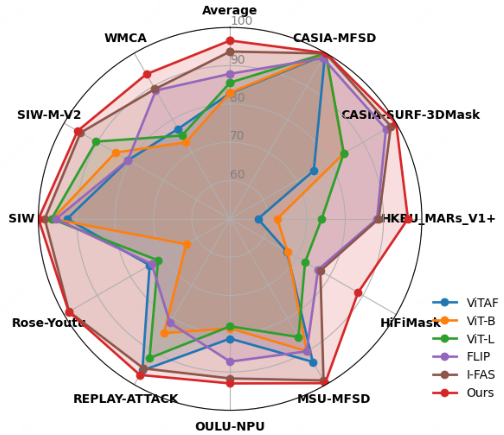

<p align="center">
  
</p>
<h2 align="center">🧠 FaceCoT: A Chain-of-Thought VQA Dataset for Face Anti-Spoofing</h2>

FaceCoT is the **first Visual Question Answering (VQA) dataset** tailored for **Face Anti-Spoofing (FAS)**. It addresses the shortage of high-quality text-image multimodal data by aggregating **1.08M carefully annotated samples** from **WFAS** and **CelebA-Spoof**, covering **14 distinct attack types**.

FaceCoT adopts a **hierarchical Chain-of-Thought (CoT)** annotation format that enhances interpretability and reasoning, making it ideal for building and evaluating multimodal anti-spoofing models.

---

## 📦 Dataset Overview

- **Total Samples**: 1.08M
- **Source Datasets**: WFAS, CelebA-Spoof
- **Modalities**: Image + Text (VQA)
- **Attack Types**: 14 total (see figure below)

<p align="center">
  
</p>

- **Annotations**: Structured 6-stage CoT per sample
  - `<Caption></Caption>`
  - `<Facial Description></Facial Description>`
  - `<Facial Attributes></Facial Attributes> `
  - `<Reasoning></Reasoning>`
  - `<Spoofing Description></Spoofing Description>`
  - `<Conclusion></Conclusion>`

---

## 📊 Data Composition

| Subset Name                  | Source Dataset   | Samples | Annotation Method        |
|-----------------------------|------------------|---------|--------------------------|
| FaceCoT_Gold100k_CelebA     | CelebA-Spoof      | 51808    | GPT-4o + Expert Calibration|
| FaceCoT_Gold100k_WFAS       | WFAS              | 48192    | GPT-4o + Expert Calibration| 
| FaceCoT_Silver982K_CelebA   | CelebA-Spoof      | 494405    | Auto-generated (FAS-CoT) |
| FaceCoT_Silver982K_WFAS     | WFAS              | 488063    | Auto-generated (FAS-CoT) |


---

## 🏆 Benchmark Results

Our proposed a CoT-Enhanced Progressive Learning (CEPL) strategy to better leverage the CoT data and boost model performance on FAS tasks, final achieve **state-of-the-art (SOTA)** performance across **11 public FAS benchmarks**.

<p align="center">
  
</p>

<sub>📌 Full results and comparison with prior works can be found in the [paper](#).</sub>

---

## 🔧 To-Do / Coming Soon

| Component            | Status       | Notes                             |
|---------------------|--------------|-----------------------------------|
| ✅ Dataset Release   | **Completed**| -                         |
| ✅ Paper             | **Available**| -             |
| 🚧 Model Weights     | **Pending**  | Preparing clean release           |
| 🚧 Training Code     | **Pending**  | Reproducibility-focused cleanup   |
| 🚧 Evaluation Code   | **Pending**  | Supports all 11 test sets         |

> 📌 The model weights, training, and evaluation code will be made public **after the paper is officially accepted**.
---

## 📄 Citation

If you use this dataset in your research, please cite:

```
@misc{facecot2025,
  title={FaceCoT: A Chain-of-Thought VQA Dataset for Face Anti-Spoofing},
  author={todo},
  year={2025},
  url={todo}
}
```
