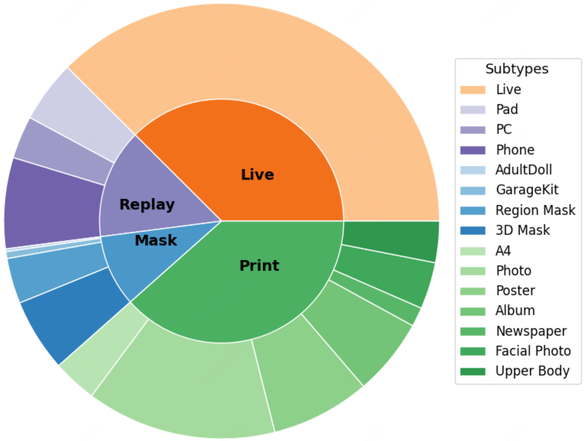

<p align="center">
  
</p>

<h1 align="center">FaceCoT: A Chain-of-Thought Dataset for Face Anti-Spoofing</h1>

## Overview

To address the challenge of high-quality data shortage in current text-image multimodal **Face Anti-Spoofing (FAS)** research, we propose and publicly release the **FaceCoT** dataset.

**FaceCoT** is the **first Visual Question Answering (VQA) dataset** specifically designed for FAS. It aggregates **1.08M training samples** from the **WFAS** and **CelebA-Spoof** datasets and covers **14 distinct attack types**.

## Key Features

* **Large-scale**: 1.08 million training samples.
* **Diverse attack types**: 14 distinct spoofing techniques.
* **Multimodal annotations**: Visual + textual Question Answering format.
* **Hierarchical CoT format**: Structured reasoning annotations for better interpretability and logical consistency.

## Dataset Composition

The types of attacks included in the dataset are illustrated below:
<p align="center">
  
</p>

## Benefits

* Enables fine-grained reasoning on spoofing detection tasks.
* Provides a natural learning pathway for multimodal CoT (Chain-of-Thought) models.
* Facilitates interpretable and explainable AI in the domain of face authentication.

## Citation

If you use this dataset in your research, please cite:

```
@misc{facecot2025,
  title={FaceCoT: A Chain-of-Thought VQA Dataset for Face Anti-Spoofing},
  author={Honglu Zhang and Zhiqin Fang and Ningning Zhao and Saihui Hou and Long Ma and Renwang Pei and Zhaofeng He.},
  year={2025},
  url={todo}
}
```
